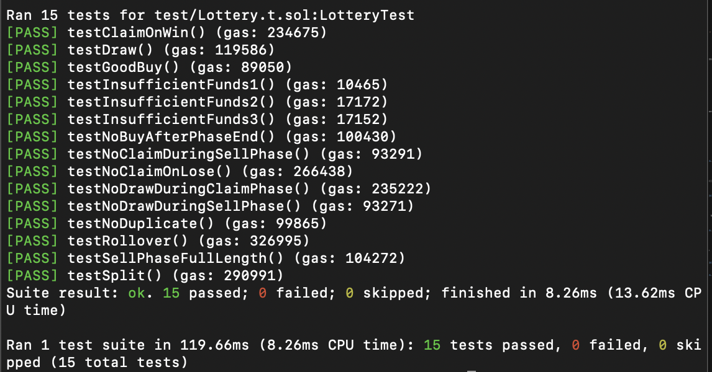

## 분석

```solidity
    function setUp() public {
       lottery = new Lottery();
       received_msg_value = 0;
       vm.deal(address(this), 100 ether);
       vm.deal(address(1), 100 ether);
       vm.deal(address(2), 100 ether);
       vm.deal(address(3), 100 ether);
    }
```

- 새 Lottery 인스턴스 생성
- 현재 컨트랙트, 1,2,3 주소에 100 ether씩 할당

```solidity
    function testGoodBuy() public {
        lottery.buy{value: 0.1 ether}(0);
    }
```

- `buy` 함수 테스트

```solidity
    function testInsufficientFunds1() public {
        vm.expectRevert();
        lottery.buy(0);
    }
```

- `buy` 함수 `revert` 테스트

```solidity
    function testInsufficientFunds2() public {
        vm.expectRevert();
        lottery.buy{value: 0.1 ether - 1}(0);
    }
```

- 0.1 ether로 보다 작은 값으로 `buy` 호출 시 `revert` 발생해야 함

```solidity
    function testInsufficientFunds3() public {
        vm.expectRevert();
        lottery.buy{value: 0.1 ether + 1}(0);
    }
```

- 0.1 ether 보다 큰 값으로 `buy` 호출 시 `revert` 발생해야 함

```solidity
    function testNoDuplicate() public {
        lottery.buy{value: 0.1 ether}(0);
        vm.expectRevert();
        lottery.buy{value: 0.1 ether}(0);
    }
```

- 똑같은 주소로 같은 번호의 `buy`를 호출하면 `revert` 발생해야 함

```solidity
    function testSellPhaseFullLength() public {
        lottery.buy{value: 0.1 ether}(0);
        vm.warp(block.timestamp + 24 hours - 1);
        vm.prank(address(1));
        lottery.buy{value: 0.1 ether}(0);
    }
```

- 다른 주소로 똑같은 번호의 `buy`를 호출하는 것은 상관 없음
- `block.timestamp + 24 hours`전에 `buy` 를 호출 할 수 있음

```solidity
    function testNoBuyAfterPhaseEnd() public {
        lottery.buy{value: 0.1 ether}(0);
        vm.warp(block.timestamp + 24 hours);
        vm.expectRevert();
        vm.prank(address(1));
        lottery.buy{value: 0.1 ether}(0);
    }
```

- `testSellPhaseFullLength` 와 동일한 로직이지만 `block.timestamp + 24 hours`이기 때문에 `revert`가 발생해야 함

```solidity
    function testNoDrawDuringSellPhase() public {
        lottery.buy{value: 0.1 ether}(0);
        vm.warp(block.timestamp + 24 hours - 1);
        vm.expectRevert();
        lottery.draw();
    }
```

- `buy` 호출한 뒤 `block.timestamp + 24 hours` 전에 `draw`를 호출하면 `revert` 가 발생해야 함

```solidity
    function testNoClaimDuringSellPhase() public {
        lottery.buy{value: 0.1 ether}(0);
        vm.warp(block.timestamp + 24 hours - 1);
        vm.expectRevert();
        lottery.claim();
    }
```

- `draw` 호출없이 `claim`을 호출하면 `revert`가 발생해야 함

```solidity
    function testDraw() public {
        lottery.buy{value: 0.1 ether}(0);
        vm.warp(block.timestamp + 24 hours);
        lottery.draw();
    }
```

- `buy` 호출하고 `block.timestamp + 24 hours` 이 후 정상적으로 draw를 호출

```solidity
    function getNextWinningNumber() private returns (uint16) {
        uint256 snapshotId = vm.snapshot();
        lottery.buy{value: 0.1 ether}(0);
        vm.warp(block.timestamp + 24 hours);
        lottery.draw();
        uint16 winningNumber = lottery.winningNumber();
        vm.revertTo(snapshotId);
        return winningNumber;
    }

```

- 당첨 번호를 가져오는 함수

```solidity
    function testClaimOnWin() public {
        uint16 winningNumber = getNextWinningNumber();
        lottery.buy{value: 0.1 ether}(winningNumber); vm.warp(block.timestamp + 24 hours);
        uint256 expectedPayout = address(lottery).balance;
        lottery.draw();
        lottery.claim();
        assertEq(received_msg_value, expectedPayout);
    }
```

- 당첨 번호의 `buy` 를 호출하고 `draw` 와 `claim` 을 순차적으로 호출
- 수령한 금액과 예상한 금액이 같아야 함

```solidity
    function testNoClaimOnLose() public {
        uint16 winningNumber = getNextWinningNumber();
        lottery.buy{value: 0.1 ether}(winningNumber + 1); vm.warp(block.timestamp + 24 hours);
        lottery.draw();
        lottery.claim();
        assertEq(received_msg_value, 0);
    }

```

- `testClaimOnWin` 로직과 비슷하지만 당첨 번호가 아니라면 `revert` 없이 진행되야 함
- 수령한 금액이 0과 같아야 함

```solidity
    function testNoDrawDuringClaimPhase() public {
        uint16 winningNumber = getNextWinningNumber();
        lottery.buy{value: 0.1 ether}(winningNumber); vm.warp(block.timestamp + 24 hours);
        lottery.draw();
        lottery.claim();
        vm.expectRevert();
        lottery.draw();
    }
```

- 당첨 금액을 수령 후 `draw` 를 재호출하면 `revert` 가 발생해야 함

```solidity
    function testRollover() public {
        uint16 winningNumber = getNextWinningNumber();
        lottery.buy{value: 0.1 ether}(winningNumber + 1); vm.warp(block.timestamp + 24 hours);
        lottery.draw();
        lottery.claim();

        winningNumber = getNextWinningNumber();
        lottery.buy{value: 0.1 ether}(winningNumber); vm.warp(block.timestamp + 24 hours);
        lottery.draw();
        lottery.claim();
        assertEq(received_msg_value, 0.2 ether);
    }
```

- 당첨되지 않는 경우 금액은 이월
- 당첨자가 수령한 금액이 이월된 금액을 포함해야 함

```solidity
    function testSplit() public {
        uint16 winningNumber = getNextWinningNumber();
        lottery.buy{value: 0.1 ether}(winningNumber);
        vm.prank(address(1));
        lottery.buy{value: 0.1 ether}(winningNumber);
        vm.deal(address(1), 0);
        vm.warp(block.timestamp + 24 hours);
        lottery.draw();

        lottery.claim();
        assertEq(received_msg_value, 0.1 ether);

        vm.prank(address(1));
        lottery.claim();
        assertEq(address(1).balance, 0.1 ether);
    }
```

- 당첨 번호를 여려 명이 뽑으면 분할해서 지급해야 함

---

## 구현

```solidity
// SPDX-License-Identifier: UNLICENSED
pragma solidity ^0.8.13;

contract Lottery {
    uint private closetime;
    uint16 private winner;
    uint private prize;
    bool private isDraw;
    uint16 private p_count;
    uint16 private winnerCount;
    bytes32 private seed;
    uint private nonce;

    mapping(address => uint16) public num;
    mapping(uint16 => address) public player;

    constructor() {
        closetime = block.timestamp + 24 hours;
        seed = keccak256(abi.encodePacked(block.timestamp, block.prevrandao, msg.sender));
    }

    function buy(uint16 number) public payable {
        if(isDraw){
            _reset();
        }
        require(msg.value == 0.1 ether);
        require(block.timestamp < closetime);
        require(player[number] != msg.sender);

        player[number] = msg.sender;
        num[msg.sender] = number;
        p_count++;
        prize += msg.value;
        seed = keccak256(abi.encodePacked(seed, msg.sender, block.timestamp, number));
    }

    function draw() public {
        require(block.timestamp >= closetime);
        require(!isDraw);
        winner = uint16(GenRandom() % p_count);
        isDraw = true;

        for (uint16 i = 0; i < p_count; i++) {
            if (num[player[i]] == winner) {
                winnerCount++;
            }
        }
    }

    function claim() public {
        require(isDraw);
        require(p_count > 0);
        require(winnerCount > 0);
        if(num[msg.sender] == winner){
            uint256 share = prize / winnerCount;
            prize -= share;
            winnerCount--;
            msg.sender.call{value: share}("");
        }
        if(winnerCount == 0){
            _reset();
        }
    }

    function winningNumber() public view returns (uint16) {
        require(isDraw);
        return winner;
    }

    function GenRandom() internal returns (uint256) {
        nonce++;
        return uint256(keccak256(abi.encodePacked(seed, block.timestamp, block.prevrandao, nonce)));
    }

    function _reset() internal {
        closetime = block.timestamp + 24 hours;
        p_count = 0;
        winnerCount = 0;
        isDraw = false;
        seed = keccak256(abi.encodePacked(block.timestamp, block.prevrandao, msg.sender));
        for(uint16 i=0; i<p_count; i++){
            delete player[i];
            delete num[player[i]];
        }
    }
}
```

### 변수

`uint private closetime`

- 현재 라운드의 종료 시간을 저장


`uint16 private winner`

- 당첨 번호를 저장


`uint private prize`

- 총 상금을 저장


`bool private isDraw`

- 현재 라운드의 `draw` 함수 호출 여부


`uint16 private p_count`

- 참가자 수를 저장


`uint16 private winnerCount`

- 당첨자 수를 저장


`bytes32 private seed`

- 난수 생성에 사용되는 시드 값을 저장


`uint private nonce`

- 난수 생성 시 사용되는 salt 값


`mapping(address => uint16) public num`

- Key : 참가자의 주소
- Value : 참가자가 선택한 번호


`mapping(uint16 => address) public player;`

- Key : 선택한 번호
- Value : 해당 번호를 선택한 참여자의 주소


---

### 함수

**buy(uint16 number)**

- 현재 `block.timestamp` 가 `closetime` 보다 작아야 함
- `msg.value` 가 0.1 ether이여야 함
- 하나의 주소로 똑같은 `number` 로 재호출이 불가능함
- 구매한 `number` 와 참가자의 주소를 저장
- `p_count` 값 증가
- `seed` 값 업데이트
- 이전에 `draw` 를 호출한 상황이면 `_reset` 을 호출하여 상태를 초기화


**draw()**

- 현재 `block.timestamp` 가 `closetime` 보다 커야함
- `isDraw` 가 `false` 값 이여야 하며 호출시 `true`로 설정됨
- `GenRandom`함수를 호출하여 난수를 생성하고 `p_count`로 나누어 나머지를 `winner` 에 저장
- 모든 참여자의 번호(`num[player[i]]`)를 조회하여 `winner`와 일치하는지 확인 일치하면 `winnerCount`증가


**claim()**

- `isDraw` 가 `true` 이여야 함
- `p_count`와 `winnerCount` 가 0보다 커야함
- 호출한 사람의 번호가 `winner` 의 값과 동일하면 `prize / winnerCount` 한 값을 `share`에 저장
- `prize`에서 `share` 을 차감 및 `winnerCount` 감소
- `share` 크기 만큼 `msg.sender` 에게 상금 지급
    - 상태 값을 먼저 변경하는 이유는 **Check-Effects-Interactions** 패턴을 통해 재진입 공격을 방지하기 위함
- `winnerCount`가 0이면 `_reset` 호출


**winningNumber()**

- `isDraw` 가 `true` 이여야 함
- `winner` 를 반환


**GenRandom()**

- 호출 시 랜덤값에 사용될 `nonce` 값을 증가시킴
- 이전에 설정된 `seed`값 + `block.timestamp` + `block.prevrandao` + `nonce` 를 압축하여 32바이트로 해시(`keccak256`)한 값을 반환


**_reset()**

- 사용자 정보와 상태 변수들을 초기화
---
## 실행 결과
